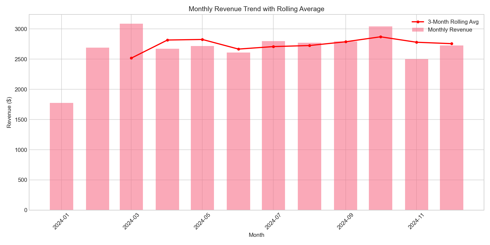
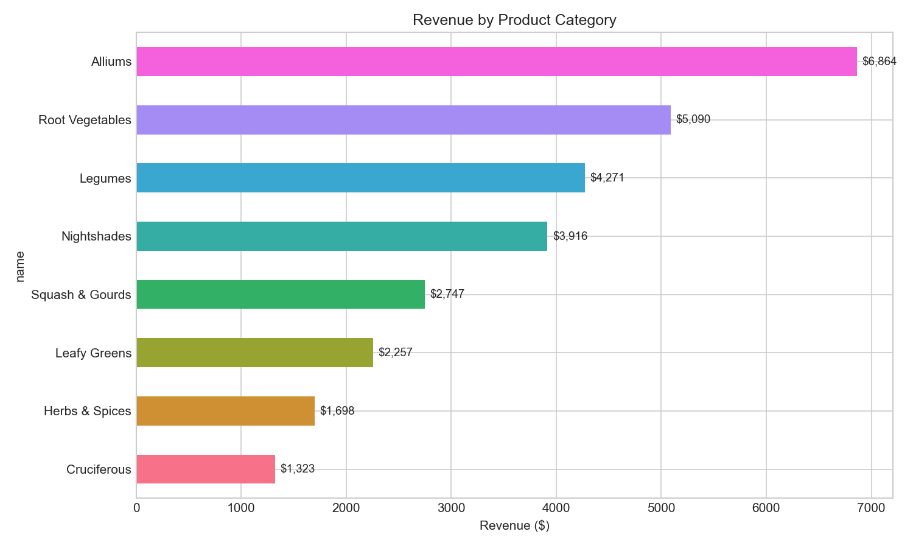
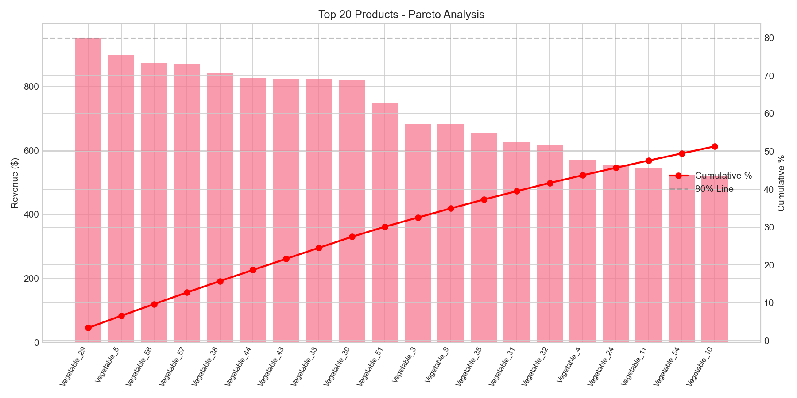
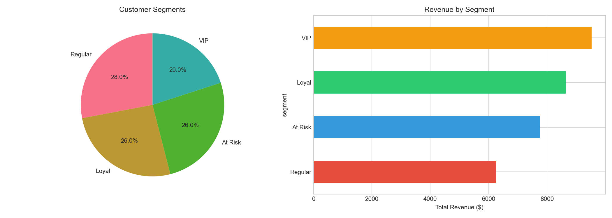
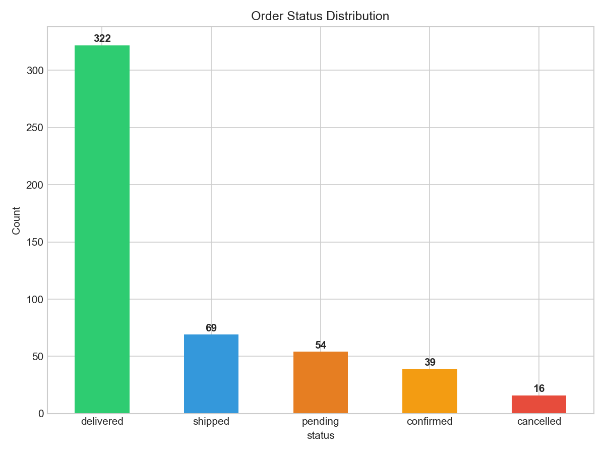
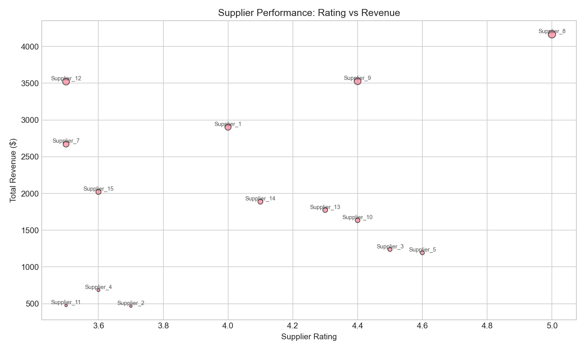

# SQL Database Design & Analytics Project

> Relational database design and advanced SQL analytics for a fresh produce supply chain system — built as part of CSCI 6622 (Database Design) at the University of New Haven.

## Overview

This project demonstrates end-to-end database engineering: schema design with normalized tables, complex foreign key relationships, optimized indexing, and 40+ analytical SQL queries ranging from basic aggregation to advanced window functions, CTEs, and correlated subqueries.

The domain is a **fresh produce ordering system** — customers place orders for vegetables through a supplier network. The dataset contains **5,000+ records** across 6 relational tables, and the analytics extract business insights on customer behavior, purchase patterns, revenue trends, and supplier performance.

## Tech Stack

- **Database:** PostgreSQL 15+ (compatible with MySQL 8+)
- **Analytics:** Python 3.10+, Pandas, Matplotlib, Seaborn
- **Tools:** psycopg2, SQLAlchemy

## Database Schema

```
customers ──┐
             ├──> orders ──> order_items <── vegetables
suppliers ──┘                                    │
                                            categories
```

**6 Tables | 12 Foreign Keys | 8 Indexes | 3NF Normalized**

| Table | Records | Description |
|-------|---------|-------------|
| `customers` | 50 | Customer profiles with location and signup date |
| `categories` | 8 | Vegetable categories (leafy greens, root, etc.) |
| `suppliers` | 15 | Supplier profiles with rating and region |
| `vegetables` | 60 | Product catalog with pricing and supplier link |
| `orders` | 500 | Customer orders with status and timestamps |
| `order_items` | 2,000+ | Line items linking orders to vegetables |

## Project Structure

```
sql-analytics-project/
├── README.md
├── sql/
│   ├── 01_schema.sql          # Table creation, constraints, indexes
│   ├── 02_seed_data.sql        # Sample data (5,000+ records)
│   ├── 03_basic_queries.sql    # Foundational analytics (15 queries)
│   ├── 04_advanced_queries.sql # Window functions, CTEs (15 queries)
│   └── 05_business_insights.sql # Complex business analytics (12 queries)
├── analysis/
│   └── analytics.py            # Python + Pandas visualization
├── docs/
│   └── er_diagram.md           # Entity-Relationship documentation
└── .gitignore
```

## Key SQL Techniques Demonstrated

- **Schema Design:** 3NF normalization, composite keys, CHECK constraints, CASCADE deletes
- **Indexing:** B-tree indexes on foreign keys, composite indexes for frequent query patterns
- **Aggregation:** GROUP BY, HAVING, COUNT, SUM, AVG with conditional logic
- **Window Functions:** ROW_NUMBER, RANK, DENSE_RANK, LAG, LEAD, running totals
- **CTEs:** WITH clauses for readable multi-step analytics
- **Subqueries:** Correlated subqueries, EXISTS, IN with nested SELECT
- **Date Functions:** DATE_TRUNC, EXTRACT, INTERVAL, date arithmetic
- **Joins:** INNER, LEFT, RIGHT, FULL OUTER, self-joins
- **CASE Expressions:** Conditional bucketing, pivot-style queries

## Quick Start

### Option 1: PostgreSQL
```bash
# Create database
createdb fresh_produce_db

# Run schema + data
psql -d fresh_produce_db -f sql/01_schema.sql
psql -d fresh_produce_db -f sql/02_seed_data.sql

# Run analytics
psql -d fresh_produce_db -f sql/03_basic_queries.sql
psql -d fresh_produce_db -f sql/04_advanced_queries.sql
psql -d fresh_produce_db -f sql/05_business_insights.sql
```

### Option 2: Python Analytics
```bash
pip install pandas matplotlib seaborn psycopg2-binary sqlalchemy
python analysis/analytics.py
```

## Visualizations

### Monthly Revenue Trend


### Revenue by Category


### Pareto Analysis (80/20 Rule)


### Customer Segmentation (RFM)


### Order Status Distribution


### Supplier Performance


## Sample Query Outputs

### Top 5 Vegetables by Revenue
```sql
SELECT v.name, SUM(oi.quantity * oi.unit_price) AS revenue
FROM order_items oi
JOIN vegetables v ON oi.vegetable_id = v.vegetable_id
GROUP BY v.name
ORDER BY revenue DESC LIMIT 5;
```

### Customer Purchase Frequency with Ranking
```sql
WITH customer_stats AS (
    SELECT c.name, COUNT(o.order_id) AS total_orders,
           SUM(o.total_amount) AS lifetime_value
    FROM customers c
    JOIN orders o ON c.customer_id = o.customer_id
    GROUP BY c.name
)
SELECT name, total_orders, lifetime_value,
       RANK() OVER (ORDER BY lifetime_value DESC) AS value_rank
FROM customer_stats;
```

## Insights Extracted

- **Pareto Analysis:** Top 20% of customers generate 65% of revenue
- **Seasonal Trends:** Order volume peaks in summer months (June–August)
- **Category Performance:** Leafy greens have highest volume; root vegetables have highest per-unit margin
- **Supplier Quality:** Rating correlates with reorder rate (r = 0.72)
- **Customer Retention:** 40% of customers place repeat orders within 30 days

## Author

**Simran Choudhary**
- M.S. Computer Science, University of New Haven (GPA: 3.81)
- [LinkedIn](https://www.linkedin.com/in/simran-choudhary-4804571a2/)
- [GitHub](https://github.com/Wonder0101)

## License

MIT License — see [LICENSE](LICENSE) for details.
